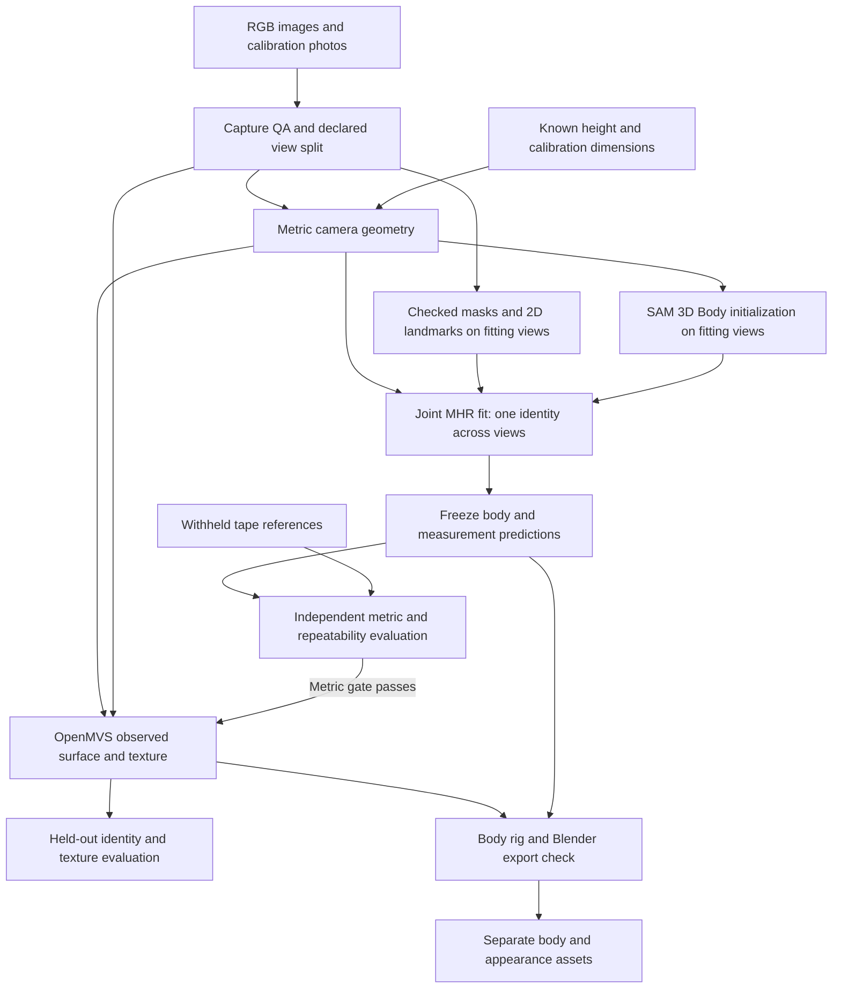

# Proposed prototype architecture

**Design only — 2026-09-25.** This document specifies an offline experiment, not a product implementation. The quantitative rationale and component sources are in [feasibility.md](feasibility.md); capture counts and decision gates are in [phase-1.md](phase-1.md).

## Architecture decision

Use an **explicit parametric body as the measurement and articulation reference**. Preserve a separate reconstruction of the visible surface for appearance. Neither representation is allowed to silently stand in for the other.

The first implementation candidate is calibrated multi-view fitting of MHR, initialized by SAM 3D Body. This is a new, bounded integration of existing components. There is no verified upstream command that takes our capture and returns validated anthropometry.

Reference values enter evaluation after freezing predictions. Held-out human pixels enter evaluation, never body fitting or texture baking. Static background features in held-out images may be used to locate their cameras; that permission must be logged.

## Asset contract

These are proposed artifacts, not files already produced.

| Asset | Contents and purpose | Prohibited interpretation |
| --- | --- | --- |
| Capture bundle | Original images, image dimensions, lens/settings, timestamps, session and outfit IDs | Preprocessed images are not substitutes for preserved originals |
| Calibration | Intrinsics, distortion, extrinsics, coordinate frame, target dimensions, QA residuals and scale provenance | Estimated focal length is not measured calibration |
| Canonical body | MHR version/LOD, identity and skeletal proportions, rest mesh, rig, pose correctives, unit conversion | Not a personal skin texture or exact hidden-body scan |
| Capture-pose body | Same identity in the protocol pose, per-view pose adjustments where allowed | Per-view shape changes are not permitted |
| Measurement report | Definition version, landmarks/planes, mm values, reference errors, repeatability, sensitivity | No “exact” measurements or unearned decimal precision |
| Observed surface | Photogrammetric mesh/point cloud, source views and coverage confidence | Garment, hair and skin may be fused; this is not the measurement body |
| Appearance | UV texture or vertex colors, observed/inferred mask, view coverage, lighting/color metadata | Clothing colors must not become underlying skin material |
| Evaluation record | All variants, all failed captures, holdouts, timings, peak memory, manual corrections | No silently discarded failures or tuned final-only screenshot |

Working geometry uses **meters**, reported measurements **millimeters**, and a documented right-handed coordinate system. Select one project convention, such as +Z up and +Y forward, and record explicit transformations from every component. Do not assume MHR, estimator output, COLMAP and Blender share units or axes. Calibrate their relationship with known lengths and round-trip checks.

## Stage 1: observation and calibration

Use one camera/lens/settings profile throughout the primary capture. Calibrate intrinsics from a measured planar target; estimate camera poses from static background features with COLMAP. Exclude the person from background matching so sway does not move the camera solution. Use target correspondences to establish/check physical scale. Keep the second known reference length out of scale fitting.

Known height is an allowed body constraint. It must agree with the calibrated scene within the experiment tolerance; it must not silently override a discrepant camera scale. If using height to initialize scale, retain that fact and test the independent scale bar. Pixel coordinates, crop transformations and updated intrinsics must remain consistent after undistortion/resizing. [OpenCV calibration](https://docs.opencv.org/4.x/dc/dbb/tutorial_py_calibration.html), [COLMAP](https://colmap.github.io/tutorial)

For one subject and a small view set, manually checked silhouettes and anatomical landmarks are acceptable. Automated masks/keypoints are proposals. Save corrections and time spent. Hair, loose hems, shoes, and accessories are excluded or assigned explicit low-confidence regions in body fitting. Dense photogrammetry retains their observed appearance separately.

## Stage 2: explicit body fitting

Use the released **SAM 3D Body DINOv3 checkpoint** as the first initializer, on fitting views only. Its estimator accepts external camera intrinsics, masks and boxes; the current implementation uses CUDA. Provide the measured intrinsics instead of trusting a learned field-of-view estimate. A fixed/manual subject box avoids making a full detector stack an unnecessary dependency. Confirm asset access and the minimal supported path in a later setup task. [Estimator source](https://github.com/facebookresearch/sam-3d-body/blob/main/sam_3d_body/sam_3d_body_estimator.py)

Retain the best valid initialization according to fitting-view reprojection consistency, then optimize a **single identity and a single set of skeletal proportions** across views. Do not average independently posed meshes or assume averaging per-view predictions removes systematic shape bias. In MHR, some skeletal scaling lives with model parameters; classify and tie those identity-related terms across frames rather than allowing them to act like pose corrections.

The proposed objective combines:

- Weighted 2D landmark reprojection, with unreliable joints down-weighted.
- Silhouette boundary and occupancy agreement over confidently fitted body regions.
- A declared known-height constraint, consistent with scene calibration.
- Shape/pose regularization and penalties against self-intersection and implausible scale changes.
- Small per-frame pose/root corrections for sway, with a strong shared-pose preference.

Do not introduce unconstrained vertex offsets in the first fit. They can absorb camera errors, clothes and motion while looking like improved identity. Do not optimize focal length and body size freely together after calibration. Keep camera uncertainty bounded by calibration evidence. If residuals require large pose corrections, reject static capture assumptions instead of explaining everything with deformation.

The silhouette is the outer garment boundary. Use an uncertainty band around clothing regions; it is not a hard assertion that skin touches every silhouette pixel. The baseline records zero clothing offset. A predeclared sensitivity check may vary a small offset band, but may not select an offset using tape values. A large change in girths under reasonable bands is evidence of insufficient information.

**Custom work required later:** shared-parameter optimization, losses/rendering, initialization selection, coordinate adapters, measurement landmark mappings, and evaluation reporting. MHR's differentiable model makes these operations possible; the integration remains untested. [MHR package](https://github.com/facebookresearch/MHR)

## Stage 3: measurement extraction and validation

Generate a body in the exact protocol A-pose for comparison with same-pose tape measurements. Keep the canonical rest body separately for rigging. Pose correctives can change cross-sections, so do not silently compare a T-pose mesh against measurements taken in another posture.

For each circumference, intersect the appropriate body region with its predeclared plane and measure the selected closed loop. Record the plane, loop and anatomical definition. Reject missing/multiple ambiguous loops; do not close a hole with an arbitrary line or substitute a nearby smaller slice. For shoulder breadth, use the straight distance between defined acromion landmarks. Inspect landmark placement visually before reading reference values.

Mesh loops and physical tapes differ around folds and concavities. Report a defined surface-loop estimate and, if needed, a separately named tape-envelope estimate; do not choose whichever is nearer the reference after unblinding. The minimum protocol uses modestly convex regions and explicitly acknowledges this remaining error source.

[SMPL-Anthropometry](https://github.com/DavidBoja/SMPL-Anthropometry) is a methodological reference, not an MHR-compatible module. Its SMPL vertex IDs and T-pose assumptions cannot be copied across representations. Mapping and checking seven MHR definitions is part of the bounded experiment.

Freeze predictions, then compare against withheld references. Sensitivity to calibration, initialization, clothing bands, and view subsets is diagnostic uncertainty, not a calibrated probability distribution. Three captures estimate repeatability on Roni; they do not provide population confidence intervals.

## Stage 4: observed appearance, after the metric gate

Use the first capture's fitting images and supplemental views with **OpenMVS** to estimate dense visible geometry, mesh it, and produce a texture. Treat incomplete regions as unobserved. Preserve a raw mesh before cleanup, and quantify any later change to measured geometry. [OpenMVS](https://github.com/cdcseacave/openMVS)

Register the observed surface to the capture-pose body using the established coordinates. Do not expand the body to fill a shirt or fit hair as skull geometry. Body-versus-surface distances can diagnose folds or reconstruction error, but do not uniquely measure garment thickness.

Evaluate face identity both with texture and in flat-shaded geometry. Texture can make a generic face look familiar. Separate head-closeup reconstruction is a targeted follow-up if body-scale photos fail; it is not silently included in a successful whole-body result.

A Gaussian or NeRF model can later be an optional appearance renderer. It must remain downstream of the measured body and retain separate ownership of its captured outfit. It cannot become the collision/measurement surface merely because its render looks better. Original [3DGS](https://github.com/graphdeco-inria/gaussian-splatting) optimizes radiance rendering, a different objective.

## Stage 5: Blender and clothing independence

Export a raw observed mesh as OBJ/PLY with its texture, and a body as a mesh plus skeleton/weights. Use FBX or a validated glTF/GLB exporter for the latter; an OBJ alone has no rig. Save native model parameters because standard skinning exports may not reproduce neural pose correctives. Verify neutral and modest posed meshes against native output. Baking evaluated poses is an acceptable diagnostic fallback, not proof that the full rig round-trips.

The Phase 1 Blender scene has separate named collections for body and captured appearance. A small existing primitive can stand in for a removable accessory or garment proxy. Hiding the appearance collection must leave a complete body; removing the proxy must not alter body topology or measurements. This proves structural independence only. It does not demonstrate extracting the original shirt as a usable garment, reconstructing hidden skin, or physically accurate clothing replacement.

Future garment assets would carry their own rest mesh/patterns, size, material properties and collision settings. Hair/scalp and accessories also remain separate. The body should not be remodeled for every outfit. [GarmentCode](https://github.com/maria-korosteleva/GarmentCode) illustrates a pattern-based route for later work; none of that belongs in the first implementation.

## Execution boundary and replacement strategy

Run the later experiment offline on a suitable NVIDIA workstation; the Mac can manage data, notes and Blender inspection. No cloud upload or paid GPU job is part of the current authorization. Proposed storage keeps original captures and references private, outside version-controlled documentation; record only anonymized summaries unless the user requests otherwise.

Keep a narrow body-model boundary: mesh evaluation, landmarks, pose, identity, rig, and unit transforms. Start with MHR only. If a predeclared failure points to its shape space or tooling, try SMPL-X under appropriate terms or native Anny/SOMA. Measure any conversion loss. If calibration/motion is the problem, changing the neural model is unlikely to fix it.

Do not build a web service, app UI, account system, garment catalogue, automatic hair editor, recommendation engine, or training pipeline to execute this experiment. The deliverable of a later Phase 1 implementation is an evidence bundle and a decision.
